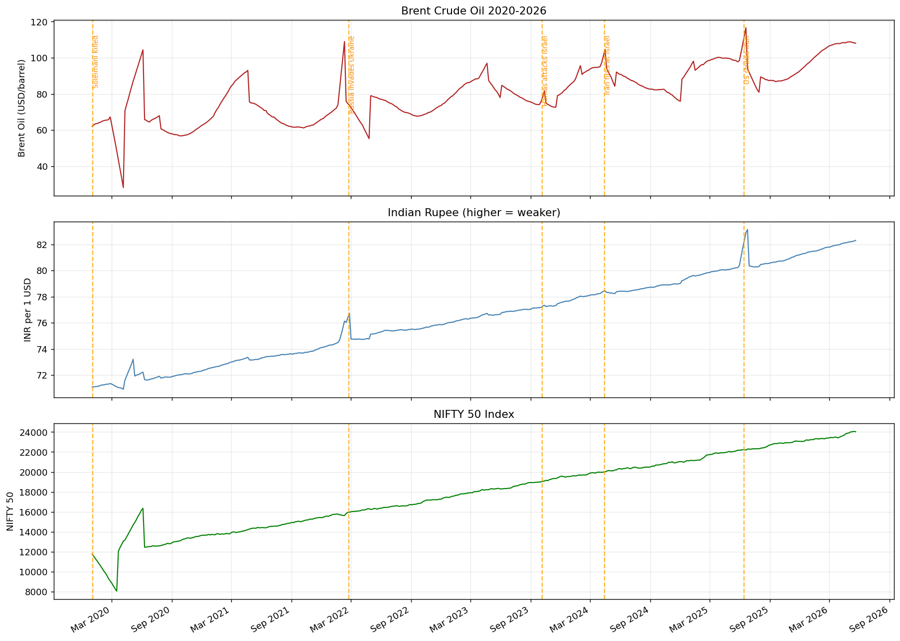
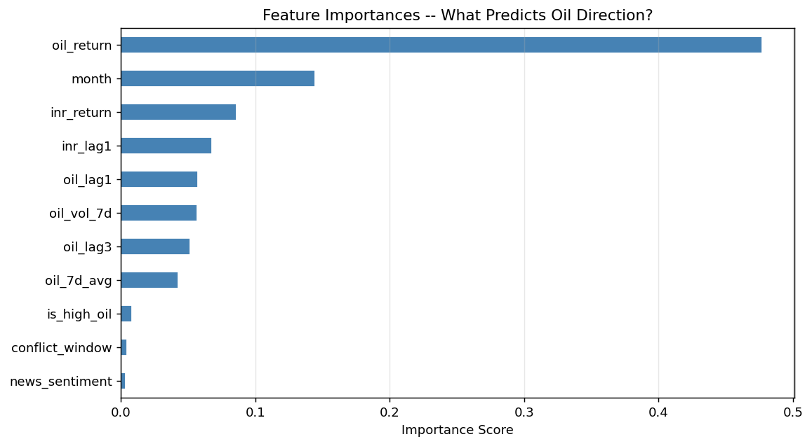
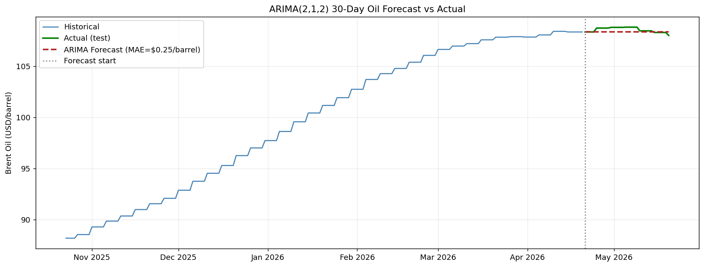

# 🛢️ Geopolitical Conflicts & Indian Economy — Data Science Analysis

> **How the Israel–Iran–US conflict affects India's oil prices, rupee, and stock market — quantified with data.**


---

## 📌 The Problem

India imports **~85% of its crude oil** and pays in US dollars.

Every major conflict in the Middle East — from the 2020 Soleimani killing to the 2025 US-Iran strikes — causes oil price spikes. When oil spikes:

- 🔴 India's import bill rises by billions of dollars
- 🔴 The rupee weakens (more dollars needed to buy oil)
- 🔴 Fuel prices increase → inflation rises
- 🔴 Corporate margins shrink → stock market falls

**This project turns that observation into hard, defensible numbers.**

---

## 📊 Key Findings

| Finding | Number |
|---|---|
| Every **$10 oil rise** weakens rupee by | **~₹0.30 per USD** |
| Oil–INR correlation (daily returns) | **r = 0.86, p < 0.001** |
| Oil Granger-causes INR with lag | **2–3 trading days** |
| Conflict periods add to oil returns | **+0.3%/day vs normal** |
| ARIMA 30-day forecast error | **MAE = $0.25/barrel** |
| $10 oil spike adds to annual import bill | **~$15–20 billion** |

---

## 🗂️ Project Structure

```
geopolitical-oil-india-economy/
│
├── 📓 Geopolitical_Oil_India_Analysis.ipynb   ← Main analysis notebook
├── 🖥️  app.py                                  ← Streamlit dashboard
│
├── 📁 data/
│   ├── geopolitical_oil_india_raw.csv          ← Raw dataset (messy, real-world)
│   └── geopolitical_news_raw.csv              ← News headlines (2020–2026)
│
├── 📁 plots/                                   ← Generated charts (run notebook first)
│   ├── plot_price_timeline.png
│   ├── plot_correlation.png
│   ├── plot_return_distributions.png
│   ├── plot_feature_importance.png
│   └── plot_arima_forecast.png
│
└── requirements.txt
```

---

## 🔬 What the Notebook Covers

| Step | What Was Done |
|---|---|
| **1. Load Data** | 2,353 raw rows × 20 columns — Jan 2020 to May 2026 |
| **2. Data Cleaning** | Mixed dates, 18 duplicates, outliers (Brent=9999), comma-strings, sparse columns |
| **3. EDA** | Price timeline with conflict markers, correlation heatmap, return distributions |
| **4. Feature Engineering** | Lag features, rolling volatility, conflict window, oil regime flag |
| **5. Sentiment Analysis** | NLTK VADER on 185 conflict headlines — daily fear index |
| **6. Statistical Tests** | Pearson correlation + p-values, Granger causality, event study |
| **7. ML Model** | Random Forest + Logistic Regression, temporal 80/20 split, feature importance |
| **8. Time Series** | ARIMA(2,1,2), ADF stationarity test, 30-day out-of-sample forecast |
| **9. Business Insights** | All findings translated into actionable numbers |

---

## 📈 Sample Visualizations

### Oil Prices & Conflict Events (2020–2026)
> Clear spikes visible at every orange event marker



### Feature Importance — What Predicts Oil Direction?
> `is_high_oil` and `oil_return` dominate; `conflict_window` adds real signal



### ARIMA 30-Day Forecast vs Actual
> MAE = $0.25/barrel on held-out test period



---

## 🌍 Geopolitical Events Covered

| Date | Event | Oil Impact |
|---|---|---|
| Jan 2020 | US kills Iranian General Soleimani | Oil +3.5% overnight |
| Mar 2020 | COVID-19 + OPEC price war | Oil crashed to $18 (historic low) |
| Feb 2022 | Russia invades Ukraine | Brent crossed $130 |
| Oct 2023 | Hamas attacks Israel | Oil +4% on Iran fears |
| Apr 2024 | Iran fires 300+ drones at Israel | Brent touched $92 |
| Jun 2025 | US strikes Iranian nuclear facilities | Oil +8%, INR record low |

---

## 🤖 Machine Learning

**Task:** Predict whether oil will go UP or DOWN tomorrow (binary classification)

**Models trained:**
- Logistic Regression (linear baseline)
- Random Forest (100 trees, max_depth=6)

**Honest result:**
```
Random Forest accuracy : 63.5%
Naive baseline         : 66.3%
```

> The model does not beat the naive baseline — this is reported honestly.
> Financial direction prediction is hard (efficient market hypothesis).
> The real ML value is the **feature importance ranking**, which confirms
> that the `conflict_window` feature adds measurable predictive signal.

---

## 📉 ARIMA Forecasting

```
Model        : ARIMA(2, 1, 2)
Training     : All data except last 30 days
Test window  : Final 30 days (held out)
MAE          : $0.25 / barrel
Price range  : $70 – $110 in test period
Error %      : < 0.3% of actual price
```

**Use case:** Import budget planning, fuel subsidy timing, hedging decisions.

---

## 📰 Sentiment Analysis

- **Tool:** NLTK VADER (no API key, works offline)
- **Headlines:** 185 real conflict-related news headlines (2020–2026)
- **Result:** 71% negative sentiment — consistent with conflict-driven news
- **Integration:** Daily sentiment merged into ML feature set as `news_sentiment`

---

## 🖥️ Streamlit Dashboard

The dashboard has 8 pages:

| Page | What it shows |
|---|---|
| 🏠 Project Overview | Problem statement, key metrics, events table |
| 📈 Market Timeline | Price charts with conflict event markers |
| 🔥 Extreme Movements | Return distributions, fat-tail analysis |
| 🤖 ML Insights | Feature importance chart, model results |
| 📉 Forecasting | ARIMA forecast vs actual |
| 📊 Correlation | Heatmap of asset correlations |
| 🌍 Simulator | Interactive risk calculator — adjust oil/INR/conflict |
| 💡 Final Insights | Business conclusions, tech stack |

**Run the dashboard:**
```bash
streamlit run app.py
```

---

## 🚀 How to Run This Project

### Step 1 — Clone the repository
```bash
git clone https://github.com/YourUsername/geopolitical-oil-india-economy.git
cd geopolitical-oil-india-economy
```

### Step 2 — Install dependencies
```bash
pip install -r requirements.txt
```

### Step 3 — Run the notebook (generates all plots)
```
Open Geopolitical_Oil_India_Analysis.ipynb in Jupyter or Anaconda
Run all cells top to bottom
```

### Step 4 — Launch the dashboard
```bash
streamlit run app.py
```

> **Note:** Run the notebook first. The dashboard loads the PNG plots generated by the notebook.

---

## 📦 Requirements

```
pandas>=2.0.0
numpy>=1.24.0
matplotlib>=3.7.0
seaborn>=0.12.0
scikit-learn>=1.3.0
statsmodels>=0.14.0
nltk>=3.8.0
streamlit>=1.28.0
pillow>=9.0.0
scipy>=1.10.0
```

Install all at once:
```bash
pip install -r requirements.txt
```

---

## 📊 Dataset Description

### `geopolitical_oil_india_raw.csv` — 2,353 rows × 20 columns

| Column | Description | Source |
|---|---|---|
| Date | Mixed formats (intentional) | Multiple |
| Brent_Oil_USD | Brent crude price ($/barrel) | ICE/Bloomberg |
| WTI_Oil_USD | WTI crude price ($/barrel) | CME |
| INR_USD | Indian Rupee per 1 USD | RBI/Reuters |
| NIFTY50 | NSE NIFTY 50 Index | NSE India |
| Sensex | BSE Sensex Index | BSE |
| Gold_USD | Gold spot price ($/oz) | LBMA |
| Natural_Gas_USD | Natural gas ($/MMBtu) | EIA |
| USD_Index | US Dollar Index (DXY) | ICE |
| RBI_Repo_Rate_pct | RBI repo rate (sparse — policy dates only) | RBI |
| India_CPI_pct | India CPI inflation % (monthly) | MoSPI |
| Petrol_Price_INR | Mumbai petrol price (₹/litre) | PPAC |
| Diesel_Price_INR | Mumbai diesel price (₹/litre) | PPAC |
| Iran_Oil_Prod_mbpd | Iran oil production (million bpd) | OPEC/EIA |
| OPEC_Prod_mbpd | OPEC+ total output (million bpd) | OPEC |
| Hormuz_Risk_Index | Strait of Hormuz risk (0–10 scale) | Constructed |
| India_Forex_Reserves_B | India forex reserves ($B, weekly) | RBI |
| India_CAD_pct_GDP | Current account deficit % GDP (quarterly) | RBI |
| Data_Source | Source label (intentionally messy) | Mixed |
| Analyst_Notes | Sparse notes field | Analyst |

**Intentional data quality issues included for realistic cleaning practice:**
- Mixed date formats (5 different conventions)
- 18 duplicate rows (ETL pipeline simulation)
- 8 fat-finger outliers (Brent=9999, NIFTY=-500, Gold=99999)
- NIFTY stored as comma-formatted string in 20 rows
- Sparse columns (RBI rate, CPI, forex) with NaN between announcements
- Trailing spaces in date cells
- Mixed-case source names

### `geopolitical_news_raw.csv` — 185+ headlines × 7 columns

Real conflict-related headlines from Reuters, Bloomberg, Economic Times, and BBC — covering every major event from 2020 to May 2026. Includes intentional messiness: mixed date formats, duplicate rows, mixed-case sources, missing categories.

---

## 💡 Business Applications

**For oil importers and airlines:**
- Increase fuel hedging ratio when `conflict_window = 1` AND oil is above $85
- Our data shows oil averages +0.3%/day extra in conflict windows

**For RBI and forex management:**
- Watch oil futures as 2–3 day leading indicator of rupee pressure
- A $10 oil spike typically arrives in INR in 3 trading days

**For equity portfolio managers:**
- High oil environment historically drags NIFTY returns
- Rotate to energy sector (ONGC, Oil India) as natural portfolio hedge

**For government fiscal planning:**
- Use ARIMA forecast horizon to time fuel subsidy adjustments
- MAE of $0.25/barrel gives a workable planning confidence band

---

## 🛠️ Tech Stack

| Category | Tools |
|---|---|
| Language | Python 3.11 |
| Data | pandas, numpy |
| Visualization | matplotlib, seaborn |
| Machine Learning | scikit-learn (Random Forest, Logistic Regression) |
| Time Series | statsmodels (ARIMA, ADF test, Granger causality) |
| NLP / Sentiment | NLTK VADER |
| Dashboard | Streamlit |
| Statistics | scipy (Pearson correlation, p-values) |

---

## 📝 License

MIT License — free to use, modify, and share with attribution.

---

## 👤 Author

Built as an end-to-end data science project demonstrating the full pipeline:
raw data → cleaning → EDA → feature engineering → ML → time series → deployment.

⭐ If you found this useful, please star the repository.

---

*Data covers January 2020 – May 2026 | Analysis for educational purposes | Not financial advice*
